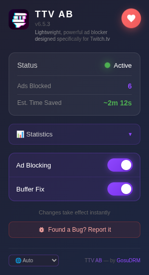
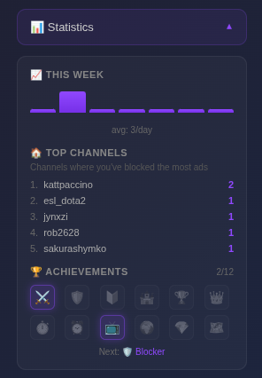

# TTV AB

A lightweight Chromium-based browser extension that blocks ads on Twitch.tv streams.

🔗 **Repository:** [https://github.com/GosuDRM/TTV-AB](https://github.com/GosuDRM/TTV-AB)

  
  

## ✨ Features

- ✅ Blocks preroll and midroll ads
- ✅ **Blocks anti-adblock popups** ("Support streamer by disabling ad block")
- ✅ No purple screen errors
- ✅ Works with all stream qualities
- ✅ Manifest V3 compatible
- ✅ Simple enable/disable toggle
- ✅ Auto-refresh on player crash
- ✅ Persistent "Ads Blocked" & "Popups Blocked" statistics
- ✅ **Statistics Dashboard** with time saved, weekly charts, and achievements
- ✅ **12 Achievement Badges** to unlock as you block ads
- ✅ **Language Selector** - 11 languages supported (EN, ES, FR, DE, PT, IT, JA, KO, ZH-CN, ZH-TW, RU)
- ✅ Per-channel ad blocking breakdown
- ✅ Modern, animated UI (Cyberpunk/Neon aesthetic)
- ✅ Lightweight and fast

## 📖 Usage

1. Navigate to [twitch.tv](https://twitch.tv)
2. Open any live stream
3. Ads will be automatically blocked
4. Click the extension icon and use the toggle to enable/disable
5. Change language via the dropdown in the footer

## ⚙️ How It Works

The extension intercepts Twitch's HLS video playlists and:
- Strips ad segments from M3U8 playlists
- Fetches backup ad-free streams when ads are detected
- Caches ad segments to prevent playback

## ✨ What's New

### v4.1.9
- **Twitch Player Structure Compatibility** - Added support for Twitch's updated player shape where `core` may be under `player.playerInstance.core` (with fallback to `player.core`).
- **Player State Reads** - Updated pause, volume, quality, and buffering checks to use the compatibility resolver so reload/buffering logic works on both structures.

See [CHANGELOG.md](CHANGELOG.md) for full version history.

## 👤 Author

**GosuDRM**
- GitHub: [@GosuDRM](https://github.com/GosuDRM)
- Email: gianpacayra@gmail.com

## ❤️ Support

If you enjoy TTV AB, consider buying me a coffee! ☕ Your support helps keep this project alive!

## 🔒 Privacy
This extension operates entirely locally and does not collect any user data. See [PRIVACY.md](PRIVACY.md) for details.

## 📄 License

MIT License with Attribution - See [LICENSE](LICENSE) for details.
