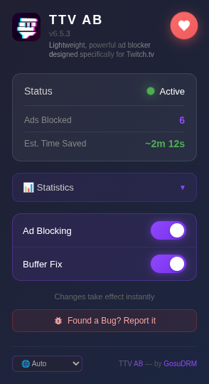
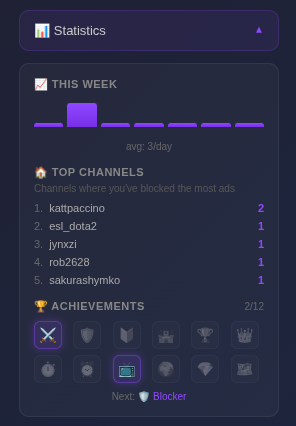

# TTV AB


[](https://github.com/GosuDRM/TTV-AB)

A lightweight browser extension that blocks Twitch ads on live streams and VODs while keeping playback stable.

## Install

- Chrome Web Store: [TTV AB - Lightweight, powerful ad blocker](https://chromewebstore.google.com/detail/ttv-ab-lightweight-powerf/mlifbfmeoafhcccmppaolojdglcbkdkg) `(Waiting for approval)`
- Firefox Add-ons: [TTV AB - Twitch Ad Blocker](https://addons.mozilla.org/en-GB/firefox/addon/ttv-ab-twitch-ad-blocker/) `(Latest)`

<p align="center">
  
  
</p>

## Features

- ✅ Blocks preroll and midroll ads on live streams and VODs
- ✅ Supports both live playback and Twitch `/videos/<id>` archives
- ✅ **Blocks anti-adblock popups** ("Support streamer by disabling ad block")
- ✅ Avoids purple-screen playback interruptions
- ✅ Restores your chosen quality after ad recovery
- ✅ Manifest V3 compatible
- ✅ Simple enable/disable toggle
- ✅ Accessible popup controls and live-updating stats
- ✅ Persistent "Ads Blocked" & "DOM Ads Blocked" statistics
- ✅ **Statistics Dashboard** with time saved, weekly charts, and achievements
- ✅ **12 Achievement Badges** to unlock as you block ads
- ✅ **Language Selector** - 11 languages supported (EN, ES, FR, DE, PT, IT, JA, KO, ZH-CN, ZH-TW, RU)
- ✅ Per-channel ad blocking breakdown
- ✅ Modern, animated UI (Cyberpunk/Neon aesthetic)
- ✅ Lightweight and fast

## Usage

1. Navigate to [twitch.tv](https://twitch.tv)
2. Open any live stream or VOD
3. Ads will be automatically blocked
4. Click the extension icon and use the toggle to enable/disable
5. Change language via the dropdown in the footer

## How It Works

The extension intercepts Twitch's live and VOD HLS video playlists and:
- Strips ad-marked segments from M3U8 playlists when Twitch injects them
- Fetches backup ad-free streams when Twitch forces playback onto an ad path
- Collapses player-side display-ad shells and overlay banners
- Suppresses injected direct video ads on VOD pages and returns playback to the real archive stream
- Caches known ad segments to reduce repeated playback disruption

During active ad recovery, Twitch may temporarily fall back to a lower-quality backup stream, such as `360p`, while the extension keeps playback alive. Once the ad window ends and the player returns to native playback, your chosen quality is restored.

## What's New

### v6.1.0
- **React-Safe Display-Ad Cleanup** - Post-ad cleanup now hides and resets Twitch-managed display-ad nodes instead of removing them from the DOM, preventing Twitch's React teardown from crashing the player into the big `?` placeholder during live and VOD navigation.
- **SDA Teardown Compatibility** - Stale display-ad shell cleanup now leaves Twitch-owned nodes attached under `#root` until Twitch unmounts them itself, avoiding `SDAContextManager` `Node.removeChild` exceptions after ad recovery.

### v6.0.9
- **Console Log Noise** - Silenced the repetitive `Fetch intercepted exception: NetworkError` logs that could flood the browser console during certain network conditions.
- **Debug Logging** - Updated the global logger to suppress all `debug` level messages by default.

### v6.0.7
- **Post-Ad Native 360p Lock** - Ad recovery no longer explicitly rewrites the native `PlaybackAccessToken` to `autoplay` during the recovery window, fixing the bug where the player's resolution menu locked down to 360p indefinitely after an ad block.
- **Pre-roll Recovery Loops** - Implemented background simulated ad-impression tracking by headless fetching of blocked ad segments. This actively clears Twitch's backend pre-roll state, putting an end to infinite looping reload cycles.

### v6.0.6
- **Broader Stitched Ad Detection** - The worker now catches more Twitch stitched ad variants before they fall through to native playback, improving ad-break interception on recent stream-side changes.
- **Turbo Break Overlay Cleanup Hardening** - Full-page Twitch Turbo / ad-break promo surfaces are now recognized more reliably and repeated cleanup of the same overlay is deduped so DOM cleanup counters stop climbing on the same page.

See [CHANGELOG.md](CHANGELOG.md) for full version history.

## Development

```sh
npm install
npm run build
npm run package:chrome
npm run lint
npm run knip
```

Load the unpacked extension from `dist/manifest.json` after `npm run build`.
Create a Chrome Web Store upload archive with `npm run package:chrome`; it writes `ttv-ab-<version>-chrome-store.zip` at the repo root.

`npm run knip` is expected to pass cleanly with the current `knip` 6.1.1 configuration.

## Support

If you enjoy TTV AB, consider buying me a coffee! Your support helps keep this project alive.

[](https://ko-fi.com/gosudrm)

## Privacy

This extension operates entirely locally and does not send any browsing or usage data off your device. See [PRIVACY.md](PRIVACY.md) for details.

## License

MIT License with Attribution - See [LICENSE](LICENSE) for details.
