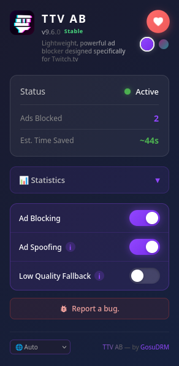

# TTV AB


[](https://github.com/GosuDRM/TTV-AB)

A lightweight browser extension that blocks Twitch ads on live streams and VODs while keeping playback stable.

## 📥 Install

| Store | Link | Status |
|-------|------|--------|
| Firefox Add-ons | [TTV AB - Twitch Ad Blocker](https://addons.mozilla.org/en-GB/firefox/addon/ttv-ab-twitch-ad-blocker/) | Stable |
| Chrome Web Store | [TTV AB - Lightweight, powerful ad blocker](https://chromewebstore.google.com/detail/ttv-ab-lightweight-powerf/mlifbfmeoafhcccmppaolojdglcbkdkg) | Stable |


<p align="center">
  
  
</p>

## ✨ Features

- ✅ Blocks preroll and midroll ads on live streams and VODs
- ✅ Supports both live playback and Twitch `/videos/<id>` archives
- ✅ Cleans up stale Twitch ad UI after recovery
- ✅ Avoids purple-screen playback interruptions
- ✅ Restores your chosen quality after ad recovery
- ✅ Manifest V3 compatible
- ✅ Simple enable/disable toggle
- ✅ Accessible popup controls and live-updating stats
- ✅ Persistent "Ads Blocked" statistics
- ✅ **Statistics Dashboard** with time saved, weekly charts, and achievements
- ✅ **12 Achievement Badges** to unlock as you block ads
- ✅ **Language Selector** - 11 languages supported (EN, ES, FR, DE, PT, IT, JA, KO, ZH-CN, ZH-TW, RU)
- ✅ Per-channel ad blocking breakdown
- ✅ Modern, animated UI (Retro/Neon aesthetic)
- ✅ **Theme Picker** - switch between the default Retro synthwave theme and the original Neon theme via two color circles in the popup
- ✅ Lightweight and fast

## 🚀 Usage

1. Install the extension from your browser's add-on store
2. Navigate to [twitch.tv](https://twitch.tv) and open any live stream or VOD
3. Ads are blocked automatically — no configuration needed
4. Click the extension icon to view stats or toggle Ad Blocking, Ad Spoofing, and Low Quality Fallback
5. Change language via the dropdown in the popup footer

## ⚙️ How It Works

TTV AB intercepts Twitch's HLS video playlists at the network level. When Twitch injects ad-marked segments or forces the player onto an ad-only path, the extension:

- Strips ad segments from M3U8 media playlists in real time
- Fetches clean backup streams using alternative player types when the native stream is ad-locked
- Serves a valid empty video segment in place of blocked ad content to keep the decoder stable
- Monitors playback health and automatically recovers from stalls after ad breaks
- Restores your original quality and volume settings once native playback resumes

When a channel opens during an ad — or an ad starts mid-stream — the extension switches to a clean backup stream within a couple of seconds so video starts playing right away. The backup targets the quality your connection has been sustaining — even if the player had just restarted on a low rung when the ad hit — with a 360p floor so a channel-open preroll (the player is still ramping up from its lowest quality at that point) never starts blurrier than 360p. Your full native quality and audio are restored automatically and seamlessly once the ad window ends. The optional **Low Quality Fallback** toggle trades some quality for an even faster first frame, starting on a quick low-resolution stream and climbing back up as the break ends.

## 🔔 What's New

### v9.9.2 — 2026-06-12
- **Leaner under the hood.** Per-poll and per-tick housekeeping costs less: playlist URL parsing is memoized, quality-preference reads are throttled, disabled debug logging is free, and the bundle slimmed down by deduplicating the toast icon.

### v9.9.1 — 2026-06-12
- **Faster handoff at ad start.** The backup stream search now kicks off the instant an ad break is detected and the player switches over as soon as a clean backup is ready, trimming the brief freeze at the start of ad breaks — with no extra requests and no added live-edge latency.

### v9.9.0 — 2026-06-12
- **Tab resilience, edge-case fixes, and a fresh look.** Channels with "stitched" in their name now play correctly, re-enabling the extension reconnects open Twitch tabs instantly instead of leaving them dead until reload, landing on a shared clip link no longer disables ad blocking for the whole tab, Firefox now recovers automatically when worker injection fails, and the welcome and support messages got a retro synthwave redesign with a gentler reminder cadence.

_See [CHANGELOG.md](CHANGELOG.md) for the complete list of changes._

## 🛠️ Development

```sh
git clone https://github.com/GosuDRM/TTV-AB.git
cd TTV-AB
npm install
npm run build          # compiles TypeScript, minifies, and bundles
npm run package:chrome # creates Chrome Web Store upload archive
npm run lint           # runs Biome linter
npm run knip           # checks for unused exports
```

The build outputs to `dist/`. Load the unpacked extension from `dist/manifest.json` in your browser's developer mode after building.

The source tree under `src/` is organized by concern — `modules/` for core ad-blocking logic (processor, parser, player, hooks, worker, state, API), `scripts/` for the bridge and background service worker, and `popup/` for the extension UI.

## 💬 Support

- Found a bug? [Open an issue](https://github.com/GosuDRM/TTV-AB/issues)
- Want to contribute? Pull requests are welcome
- If TTV AB saves you from ads, consider supporting development:

[](https://ko-fi.com/gosudrm)

## 🔒 Privacy

TTV AB operates entirely on your device. No data is ever sent to external servers — not your browsing history, not your Twitch activity, not your ad-block statistics. All counters and settings are stored in your browser's local storage. See [PRIVACY.md](PRIVACY.md) for the full privacy policy.

## 📄 License

MIT License with Attribution — See [LICENSE](LICENSE) for details.
