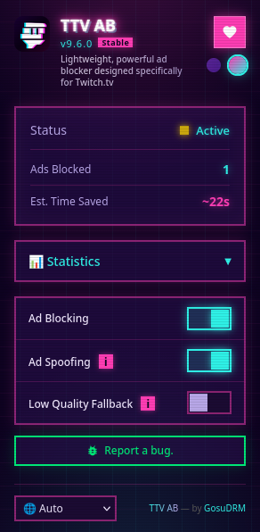
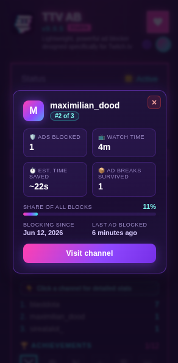
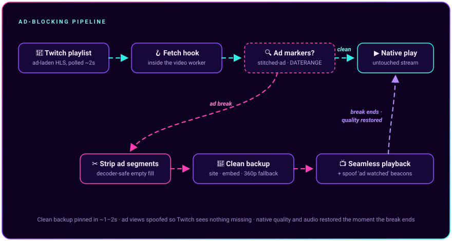

# TTV AB


[](https://github.com/GosuDRM/TTV-AB)

A lightweight browser extension that blocks Twitch ads on live streams and VODs while keeping playback stable.

## 📥 Install

> **⚠️ Supported browsers: Firefox and Chromium-based desktop browsers only.** TTV AB can't run on WebKit-based browsers like Orion, or on anything on iOS/iPadOS (every iOS browser is WebKit under the hood). The ad-blocker can't load there and the player goes to a black screen, so please use Firefox or a Chromium-based browser on a computer.

| Store | Link | Status |
|-------|------|--------|
| Firefox Add-ons | [TTV AB - Twitch Ad Blocker](https://addons.mozilla.org/en-GB/firefox/addon/ttv-ab-twitch-ad-blocker/) | Stable |
| Chrome Web Store | [TTV AB - Lightweight, powerful ad blocker](https://chromewebstore.google.com/detail/ttv-ab-lightweight-powerf/mlifbfmeoafhcccmppaolojdglcbkdkg) | Stable |


<p align="center">
  
  
</p>

## ✨ Features

- ✅ Blocks preroll and midroll ads on live streams and Twitch VODs
- ✅ Keeps a clean backup stream playing during ad breaks to reduce black screens, purple screens, and stalls
- ✅ Returns to native video quality and audio after recovery, including enhanced HEVC and AV1 qualities when available
- ✅ Keeps recovery working in background tabs and Picture-in-Picture
- ✅ Removes stale Twitch ad overlays after playback returns
- ✅ Independent, live-updating controls for Ad Blocking, Ad Spoofing, and Low Quality Fallback
- ✅ Optional Ad Spoofing to reduce anti-adblock detection
- ✅ Optional Low Quality Fallback for faster recovery; disabling it prioritizes normal-quality sources, but lower quality may still be used as a last resort
- ✅ Persistent, live-updating Ads Blocked and Time Saved totals
- ✅ Statistics dashboard with weekly charts, detailed per-channel history, and **12 Achievement Badges**
- ✅ Language selector, with 12 languages supported (EN, ES, FR, DE, PT, IT, JA, KO, ZH-CN, ZH-TW, RU, UK)
- ✅ Built-in Generate Log tool that creates a local, privacy-filtered diagnostic file for bug reports
- ✅ Accessible Manifest V3 popup with Retro and Neon themes
- ✅ Supports Firefox and Chromium-based desktop browsers

## 🚀 Usage

1. Install the extension from your browser's add-on store
2. Navigate to [twitch.tv](https://twitch.tv) and open any live stream or VOD
3. Ads are blocked automatically, no configuration needed
4. Click the extension icon to view stats or toggle Ad Blocking, Ad Spoofing, and Low Quality Fallback
5. Change language via the dropdown in the popup footer

## ⚙️ How It Works

TTV AB inspects Twitch's HLS playlists inside the browser before the video player uses them. Clean playlists pass through unchanged. On VOD pages, it also blocks the narrowly scoped client-side ad requests used by Twitch.

<p align="center">
  
</p>

- Keeps the last clean native playlist flowing, when available, while checking alternative Twitch player sources one at a time
- Accepts only playable, ad-free backups and refreshes the active backup at the live edge so it does not freeze
- Uses a small local hold segment only when removing ads would otherwise leave the decoder with no media
- Monitors backup health and rotates to another verified source if the active backup stalls
- Keeps recovery tied to the current player across background tabs and Picture-in-Picture while respecting explicit pauses
- Returns to native playback only after repeated clean checks for the same stream and ad cycle, then restores the saved quality and audio state

With **Low Quality Fallback** enabled, a clean 360p autoplay source can start sooner while normal-quality backups are checked. With it disabled, new autoplay backups are skipped and normal-quality sources are tried first. The transition can take longer, and a lower-quality rendition may still be used as a last resort when necessary to keep the ad blocked.

When **Ad Spoofing** is enabled, the extension sends Twitch the ad-progress and completion signals expected for the blocked break. This setting is separate from playlist blocking and can be turned off without disabling core ad blocking.

## 🔔 What's New

### v16.3.0 - 2026-08-28
- **Fixed some streams staying on 360p or 480p after ad recovery and prevented a stalled Previews fallback from keeping playback loading indefinitely.** Backup searches now retain the stream's sustained quality target, share one sequential search, and stop failed Preview recovery attempts within a strict deadline without accepting ad-marked media ([#65](https://github.com/GosuDRM/TTV-AB/issues/65), [#66](https://github.com/GosuDRM/TTV-AB/issues/66)).

### v16.2.9 - 2026-08-27
- **Fixed Previews hover streams still ending in Error 2000 after both native master requests were rejected.** Affected previews now check fresh Twitch sessions one at a time and start only from the exact AVC rendition whose live media playlist is playable and ad-free. Cancelled requests, ordinary players, and enhanced decoder ownership remain unchanged ([#63](https://github.com/GosuDRM/TTV-AB/issues/63)).

### v16.2.8 - 2026-08-27
- **Fixed the remaining Previews Error 2000 path and clarified the popup controls.** A hover preview whose native master request is rejected with the wrong Twitch origin now retries that request once before using the same AVC and ad-free playlist checks. The Ad Spoofing and Low Quality Fallback info dialogs are also clearer across all 12 supported languages ([#63](https://github.com/GosuDRM/TTV-AB/issues/63)).

_See [CHANGELOG.md](CHANGELOG.md) for the complete list of changes._

## 🛠️ Development

```sh
git clone https://github.com/GosuDRM/TTV-AB.git
cd TTV-AB
npm install
npm run build          # compiles TypeScript, minifies, and bundles
npm run package:chrome # creates Chrome Web Store upload archive
npm run lint           # runs Biome linter
npm run knip           # checks for unused exports
```

The build outputs to `dist/`. Load the unpacked extension from `dist/manifest.json` in your browser's developer mode after building.

The source tree under `src/` is organized by concern: `modules/` for core ad-blocking logic (processor, parser, player, hooks, worker, state, API), `scripts/` for the bridge and background service worker, and `popup/` for the extension UI.

## 💬 Support

- Found a bug? [Open an issue](https://github.com/GosuDRM/TTV-AB/issues)
- Want to contribute? Pull requests are welcome
- If TTV AB saves you from ads, consider supporting development:

[](https://ko-fi.com/gosudrm)

## 🔒 Privacy

TTV AB operates entirely on your device. No data is ever sent to external servers: not your browsing history, not your Twitch activity, not your ad-block statistics. All counters and settings are stored in your browser's local storage. See [PRIVACY.md](PRIVACY.md) for the full privacy policy.

## 📄 License

This project uses an MIT-based license with a repository attribution requirement. See [LICENSE](LICENSE) for details.
