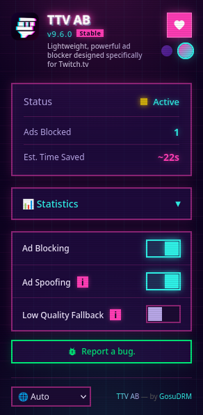
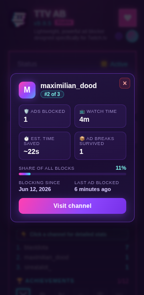
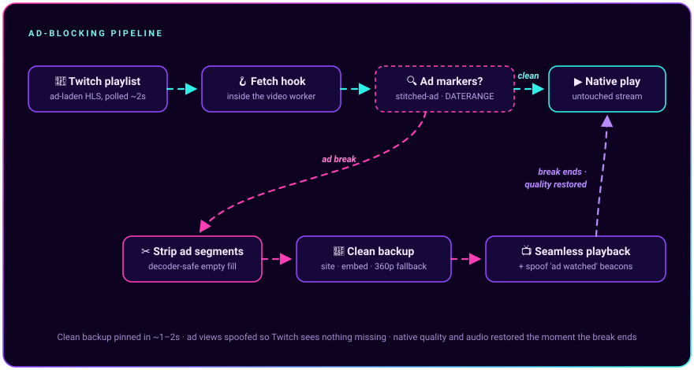

# TTV AB


[](https://github.com/GosuDRM/TTV-AB)

A lightweight browser extension that blocks Twitch ads on live streams and VODs while keeping playback stable.

## 📥 Install

> **⚠️ Supported browsers: Firefox and Chromium-based desktop browsers only.** TTV AB can't run on WebKit-based browsers like Orion, or on anything on iOS/iPadOS (every iOS browser is WebKit under the hood). The ad-blocker can't load there and the player goes to a black screen, so please use Firefox or a Chromium-based browser on a computer.

| Store | Link | Status |
|-------|------|--------|
| Firefox Add-ons | [TTV AB - Twitch Ad Blocker](https://addons.mozilla.org/en-GB/firefox/addon/ttv-ab-twitch-ad-blocker/) | Stable |
| Chrome Web Store | [TTV AB - Lightweight, powerful ad blocker](https://chromewebstore.google.com/detail/ttv-ab-lightweight-powerf/mlifbfmeoafhcccmppaolojdglcbkdkg) | Stable |


<p align="center">
  
  
</p>

## ✨ Features

- ✅ Blocks preroll and midroll ads on live streams and Twitch VODs
- ✅ Keeps a clean backup stream playing during ad breaks to reduce black screens, purple screens, and stalls
- ✅ Returns to native video quality and audio after recovery, including enhanced HEVC and AV1 qualities when available
- ✅ Keeps recovery working in background tabs and Picture-in-Picture
- ✅ Removes stale Twitch ad overlays after playback returns
- ✅ Independent, live-updating controls for Ad Blocking, Ad Spoofing, and Low Quality Fallback
- ✅ Optional Ad Spoofing to reduce anti-adblock detection
- ✅ Optional Low Quality Fallback for faster recovery; disabling it prioritizes normal-quality sources, with a temporary clean low-quality bridge available during prerolls and midrolls
- ✅ Optional Ad Break Timer in the stream's top-right corner, disabled by default
- ✅ Optional Turbo Mode that pauses new statistics and achievements while preserving existing history and all ad-blocking controls
- ✅ Persistent, live-updating Ads Blocked and Time Saved totals
- ✅ Statistics dashboard with weekly charts, detailed per-channel history, and **12 Achievement Badges**
- ✅ Language selector, with 12 languages supported (EN, ES, FR, DE, PT, IT, JA, KO, ZH-CN, ZH-TW, RU, UK)
- ✅ Built-in Generate Log tool that creates a local, privacy-filtered diagnostic file for bug reports
- ✅ Accessible Manifest V3 popup with Retro and Neon themes
- ✅ Supports Firefox and Chromium-based desktop browsers

## 🚀 Usage

1. Install the extension from your browser's add-on store
2. Navigate to [twitch.tv](https://twitch.tv) and open any live stream or VOD
3. Ads are blocked automatically, no configuration needed
4. Click the extension icon to view stats or toggle Ad Blocking, Ad Spoofing, Low Quality Fallback, and Ad Break Timer
5. Change language via the dropdown in the popup footer

## ⚙️ How It Works

TTV AB checks Twitch's HLS playlists before playback and blocks recognized client-side ad requests on VODs.

<p align="center">
  
</p>

- Checks alternative Twitch sources one at a time, using a fresh clean native playlist or a compatible silent hold while searching
- Plays only verified, playable, ad-free backups, refreshes them during the break, and rotates stalled sources
- Returns to native playback after repeated clean checks for the same stream and break, then restores quality and audio settings
- Keeps recovery tied to the current player across background tabs and Picture-in-Picture, respecting explicit pauses

**Low Quality Fallback** is on by default, allowing a clean 360p bridge sooner while higher-quality sources are checked. Turning it off prioritizes normal-quality sources; prerolls and midrolls may still use a temporary clean low-quality bridge if those sources fail. Other sources may still offer lower qualities.

**Ad Spoofing** sends Twitch progress and completion signals for blocked ads. Turning it off leaves ad blocking active.

The optional **Ad Break Timer** is off by default and can be switched on in the popup. It tracks the current break until it ends; it does not predict when your selected quality will return.

## 🔔 What's New

### v19.1.2 - 2026-10-07

- **HD Transitions** - Keep the clean backup playing until an HD stream is ready to take over, preventing premature switches that interrupt playback.

### v19.1.1 - 2026-10-06

- **Backup Quality Stability** - Prevent late playlist refreshes from undoing an HD upgrade or switching playback back to a replaced backup.

### v19.1.0 - 2026-10-06

- **Backup Rotation** - Respect cooldowns when a clean backup turns ad-marked, reducing repeated session changes during a break ([#81](https://github.com/GosuDRM/TTV-AB/issues/81)).
- **Quality Continuity** - Keep returning qualities aligned across different playlist windows and prevent stale numbering after ads.
- **Hold Compatibility** - Reject incompatible temporary media when a stream requires an initialization map, guarding a possible decoder-failure path reported in [#82](https://github.com/GosuDRM/TTV-AB/issues/82).
- **Playback Defaults** - Enable Low Quality Fallback and disable Ad Break Timer on installation and every extension update. Later choices are preserved across ordinary restarts.

_See [CHANGELOG.md](CHANGELOG.md) for the complete list of changes._

## 🛠️ Development

Clone the repository or your fork, using `main` for Chrome or `firefox` for Firefox. Install Node.js 22 and Python 3, then run these commands from the repository folder:

```sh
npm ci
npm run build
```

Make changes in the TypeScript source:

- `src/modules/`: stream handling, ad blocking, and playback recovery
- `src/scripts/`: background tasks and communication with the page
- `src/popup/`: popup controls, themes, and translations
- `tests/`: regression tests

Keep changes focused and add a regression test when fixing a bug. The build generates `dist/`; edit the source files rather than the compiled output. After source edits, run the checks in this order because tests read `dist/`:

```sh
npm run build
npm test
npm run lint
npm run typecheck
npm run knip
```

Load your build to try it locally:

- **Chrome:** Open `chrome://extensions`, enable Developer mode, then [Load unpacked](https://developer.chrome.com/docs/extensions/get-started/tutorial/hello-world#load-unpacked) and select `dist/`.
- **Firefox:** Open `about:debugging`, select This Firefox, then [Load Temporary Add-on](https://extensionworkshop.com/documentation/develop/temporary-installation-in-firefox/) and select `dist/manifest.json`.

After rebuilding, reload the extension from that page and refresh your Twitch tab. For playback changes, check the affected scenario on Twitch too. In your pull request, explain the change, the checks you ran, and anything you could not verify.

<details>
<summary>Build and release notes</summary>

- **Firefox popup files:** If the build reports that tracked popup files are out of sync, copy `popup.js` and `translations.js` from `dist/src/popup/` into `src/popup/`, then rerun the build and checks.
- **Packages:** The manifest determines which browser archives the build creates alongside `dist/`. Packaging errors stop the build.
- **Releases:** Annotated release tags must include `Firefox-Commit: <full SHA>` for the validated Firefox commit. The release workflow builds Firefox from that exact commit.

</details>

## 💬 Support

- Found a bug? [Open an issue](https://github.com/GosuDRM/TTV-AB/issues)
- Want to contribute? Pull requests are welcome
- If TTV AB saves you from ads, consider supporting development:

[](https://ko-fi.com/gosudrm)

## 🔒 Privacy

TTV AB operates entirely on your device. No data is ever sent to external servers: not your browsing history, not your Twitch activity, not your ad-block statistics. All counters and settings are stored in your browser's local storage. See [PRIVACY.md](PRIVACY.md) for the full privacy policy.

## 📄 License

This project uses an MIT-based license with a repository attribution requirement. See [LICENSE](LICENSE) for details.
